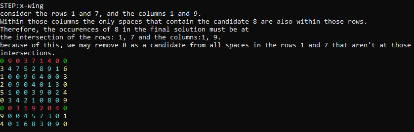

<h1>SudokuCoach</h1>

<h2>Description</h2>

  - The project is primarily a sudoku solver that doesn't use a recursive algorithm. Rather,
 it searches for patterns that are understandable by humans. It also contains a terminal user
 interface (TUI) which describes the most recent pattern found using text and color.
  - The patterns this algorithm searches for are: Sole Candidate, Unique Candidate, Block
 to Row or Column interaction, Block to Block interaction, Naked Subset, Hidden Subset,
 X-Wing and Y-Wings. Some resources I used for determining the patterns are
https://www.kristanix.com/sudokuepic/sudoku-solving-techniques.php and https://www.sudokuwiki.org/Y_Wing_Strategy.
 - my goal with this project is to improve upon a very simple recursive solver I made a couple years ago,
and to help myself on my own sudoku solving pursuits.
 - The project is completed, although it is still somewhat of a work in progress as the rabbit hole of sudoku
solving patterns goes very deep, and I may decided to add more solving patterns in later. However, the algorithm is
complex enough to solve every New York Times hard sudoku I have tested it with.

<h2>How to Run</h2>

 - clone the repository and run using the provided visual studio solution.
 - The project may alternatively built using any C++ compiler, but only Visual Studio has been provided.

<h2>How to Use</h2>

 - the program searches the 'sudokus' folder for csv files formatted as sudoku puzzles.
 - ensure the puzzle is valid, the algorithm will not accept puzzles that are not solveable.
 - Enter one of your own puzzles or run one of the provided puzzles by entering its name then pressing return
to get the next step.

<h2>Samples</h2>
<h4>Sole Candidate</h4>

<h4>Unique Candidate</h4>

<h4>Block to Row/Col</h4>

<h4>Block to Block</h4>

<h4>Naked Subset/h4>
  

<h4>Hidden Subset</h4>

<h4>X-Wing</h4>

<h4>YWing</h4>

